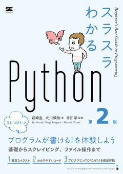
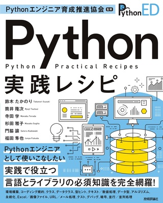
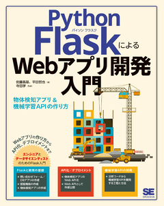
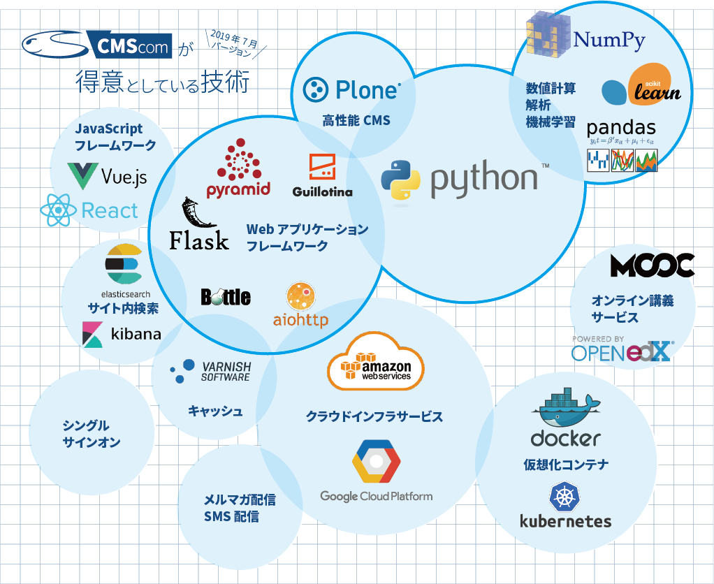

---
# try also 'default' to start simple
theme: default
background: ./images/kumamoto-jo.jpg
# apply any windi css classes to the current slide
class: "text-center"
# https://sli.dev/custom/highlighters.html
highlighter: shiki
# show line numbers in code blocks
lineNumbers: false
# some information about the slides, markdown enabled
info: |
  ## Python関連プレゼンテーション
  Manabu TERADA @terapyon

  CMSコミュニケーションズ [CMScom](https://www.cmscom.jp)
  CC-BY 4.0
# persist drawings in exports and build
drawings:
  persist: false
---

# Python環境の今 2022

Pythonの環境構築には複数の方法が存在します。このトークでは、Python環境構築に必要な選択すべき項目をあげ、それぞれについて選択方法を解説します。

<div class="pt-12">
  <span @click="$slidev.nav.next" class="px-2 py-1 rounded cursor-pointer" hover="bg-white bg-opacity-10">
    プレゼンテーションスタート <carbon:arrow-right class="inline"/>
  </span>
</div>

<div class="abs-br m-6 flex gap-2">
  <a href="https://twitter.com/terapyon" target="_blank" alt="GitHub"
    class="text-xl icon-btn opacity-50 !border-none !hover:text-white">
    <carbon-logo-twitter />
  </a>
  <a href="https://github.com/terapyon/slides" target="_blank" alt="GitHub"
    class="text-xl icon-btn opacity-50 !border-none !hover:text-white">
    <carbon-logo-github />
  </a>
</div>

---

# 自己紹介

- 寺田 学 (Manabu TERADA) [@terapyon](https://twitter.com/terapyon)
- (株)CMSコミュニケーションズ代表
- Pythonエンジニア兼経営者

PythonベースのWeb系システム構築やコンサルティングを行っている。
昨年から企業や学校に向けたプログラミング教育にも関わっている


---

# 共著・監修書籍

最近、寺田が関連していいる書籍の紹介

<div grid="~ cols-3 gap-3" m="-t-3">

```text
スラスラわかるPython 第2版
翔泳社: 2021
岩崎 圭 著、北川 慎治 著、寺田 学 監修
```

```text
Python実践レシピ
技術評論社: 2022
鈴木たかのり著、筒井隆次 著、寺田学 著、
杉田雅子 著、門脇諭 著、福田隼也 著
```

```text
FlaskによるWebアプリ開発入門 
物体検知アプリ&機械学習APIの作り方
翔泳社: 2022
佐藤 昌基 著、平田 哲也 著、寺田 学 監修
```








</div>


---

# 会社紹介

- (株)CMSコミュニケーションズ https://www.cmscom.jp
- Ploneを使ったWebシステムの開発
- Pythonを用いたシステム開発
- Python関連コンサルティング
- プログラミング教育



---

# その他関連組織

- 一般社団法人 **PyCon JP** Association 代表理事: https://www.pycon.jp
- 一般社団法人Pythonエンジニア育成推進協会 顧問理事: https://www.pythonic-exam.com
- 国立大学法人一橋大学 社会学研究科 地球社会専攻 非常勤講師
- NVDA日本語チーム
- Plone User's Group Japan
- Python mini hack-a-thon 主宰

---
layout: section

---

# このトークの概要

2017 年に PyCon mini Kumamoto でトークした内容を 2022 年版にアップデートしたものです

https://speakerdeck.com/terapyon/sugushi-merareru-pythonfalsehuan-jing-gou-zhu

---
layout: section

---
# Python バージョン

何を使っていますか？

---

# 寺田のオススメ

|                        |                  |
| ---------------------- | ---------------- |
| 実装                   | CPython          |
| Python バージョン       | 3.9              |
| インストール方法         | 公式インストーラ |
| 仮想環境                | venv             |
| パッケージインストール     | pip              |
| エディタ                | VS Code           |


---
layout: section

---

# 実装

---

# Python 実装と選択

<div grid="~ cols-2 gap-4">
<div>

## 実装の種類

- CPython
  - C で実装されている
- PyPy
  - Python で実装
- MicroPython
  - 機能限定のPython
  - マイクロコントローラー向
- Cython
  - 高速化

</div>
<div v-click>

## 選択基準

- 特別な理由がなければ
- CPython でいい。
- Python といえば CPython のことを言う

</div>
</div>
---
layout: section

---

# バージョン

---

# バージョン年表 (〜2013年)

|    | Python 2 | Python 3 | Event |
| -- | ------- | -------- | ---- |
| 1994 | 1.0 |  |  |
| ... |  |  |  |
| 2008 | 2.6 | 3.0 |  |
| 2009 |     | 3.1 |  |
| 2010 | 2.7 |     | PyCon APAC in SG |
| 2011 |     | 3.2 | PyCon JP |
| 2012 |     | 3.3 |  |
| 2013 |     |     | PyCon APAC in Japan |


---

# バージョン年表 (2014年〜)

|    | Python 2 | Python 3 | Event |
| -- | ------- | -------- | ---- |
| 2014 |  | 3.4 |  |
| 2015 |  | 3.5 |  |
| 2016 |  | 3.6 | Python Boot Camp |
| 2017 |  |  | PyCon mini Kumamoto |
| 2018 |  | 3.7 | PyCon Kyushu in Fukuoka |
| 2019 |  | 3.8 | PyCon Kyushu in Okinawa |
| 2020 | End of Life | 3.9 |  |
| 2021 |  | 3.10 |  |
| 2022 |  | 3.11 | PyCon Kyushu in Kumamoto |


---

# Python バージョンの選択

- 特別な理由がなければ
  - 最新が出てから、半年くらいたったバージョン
- 選択するときのポイント
  - ライブラリが対応しているか？
  - 動作させる環境は？

---

# バージョンアップのタイミング

- あせって、Python のバージョンを上げなくてもいい
  - 5年間の保守期間があるので
- 上げるモチベーション
  - 新しい機能を使いたい
  - ライブラリの対応状況が変わる
  - 積極的にやらないことが多い

---
layout: section

---

# インストール方法

---

# インストール方法

<div grid="~ cols-2 gap-4">
<div>

## インストール方法の種類

- 公式インストーラ
  - バニラインストーラ
- 公式版をソースコンパイル
- OS パッケージマネージャー
  - apt / DNF / brew
- Anaconda
  - 様々なパッケージをまとめてインストール

</div>
<div v-click>

## インストール方法の選択

- 特に理由がなければ
  - 公式インストーラ
- Linux 環境なら
  - ソースコンパイル
- パッケージマネジャーを使う場合もある

</div>
</div>

---
layout: image

image: images/python.org.jpg

class: my-cool-content-on-the-right
---

---

# Anaconda

- 科学技術計算系のパッケージが同梱されている
- インストールは手軽だが、
  - ハマリポイントも多い
- Windows 環境でも、Anacondaを使わずに、公式版と pip でインストールが可能
  - **wheel** のおかげ
- 大企業で使う場合は有料化されているので注意

---

# Python のバージョンを複数

- OS 上に複数のマイナーバージョン
  - 公式インストーラでインストール可能
  - マイクロバージョンを混在させることはできない

<br>
<br>

例

```
Python 3.9.8
```

- 3: メジャー
- 9: マイナー
- 8: マイクロ

---
layout: section

---

# 仮想環境

---

# 仮想環境とは

- 一つの OS 上に、複数の Python 環境を作れる
- 利用する Python ライブラリを区分できる
- OS 上のグローバルな Python 環境をクリーンに保てる

<div v-click>

- Python レイヤーの仮想環境に限定
- OS の仮想化やコンテナ化とは別物
</div>

---

# 仮想環境の種類

- venv モジュール
  - Python 標準ライブラリ
- virtualenv
  - 以前の Python では使われていた
  - venv モジュールがある今、使われない
- pyenv
  - Python のマイクロバージョンの切替も可能
- conda コマンド
  - Anaconda で使う

---

# 仮想環境の選択

- venv モジュール

venv モジュールの使い方

<div grid="~ cols-2 gap-4">
<div>

Linux / macOS

```bash
$ python -m venv venv  # venvというフォルダができる
$ source venv/bin/activate  # 仮想環境を有効化
(venv) $   # プロンプトが変化
(venv) $ deactivate  # 仮想環境の無効化
$ rm -r venv  # 仮想環境のフォルダを削除
```

</div>
<div>

Windows

```shell
> py -m venv venv  # venvというフォルダができる
> venv\Scripts\Activate.ps1 # 仮想環境を有効化
(venv) >   # プロンプトが変化
(venv) > deactivate # 仮想環境の無効化
> rmdir venv  # 仮想環境のフォルダを削除
```
</div>
</div>

---
layout: section

---

# パッケージのインストール

---

# パッケージのインストールとは

- サードパーティー製パッケージを導入
- （基本的には）PyPI (パイピーアイと読む) から様々なパッケージをインストール
    - https://pypi.org
- 例えば
    - 画像処理をする **Pillow**
    - Webフレームワーク **Flask**
    - データ分析に使う **pandas**

---
layout: image

image: images/pypi.org.jpg

class: my-cool-content-on-the-right

---

---

# pip コマンド

- Pythonに同梱しているコマンド

- pip で Pillowをインストール

```bash
$ sourse venv/bin/activate  # 仮想環境を有効化
(venv) $ pip install pillow  # Pillowをインストール
(venv) $ pip freeze > requirements.txt  # パッケージリストを作成
(venv) $ pip install -r requirements.txt  # パッケージリストを元にインストール
(venv) $ pip install -U pillow  # Pillowをアップデート
```

---

# wheel とは

- PEP427 The Wheel Binary Package Format 1.0 (最新は PEP 491 Format 1.9)
- ビルド済みの配布用パッケージ
- Cコンパイラが必要なパッケージに対応
- ピュアPythonでもwheel提供されている
- 様々なプラットフォームに対応


```text
numpy-1.22.1-cp39-cp39-win_amd64.whl 
numpy-1.22.1-cp39-cp39-manylinux_2_17_x86_64.manylinux2014_x86_64.whl 
numpy-1.22.1-cp39-cp39-macosx_11_0_arm64.whl
```

- プラットフォームに依存していない場合

```text
Flask-2.0.2-py3-none-any.whl
```


最近は、Windows / macOS / Linux用などのwheelが専用に準備されているパッケージが多い

---
layout: section

---

# エディタ

---

# エディタ

<div grid="~ cols-2 gap-4">
<div>

## エディタの種類

- VS Code
    - 無料、統合環境、様々な言語に対応
- PyCharm
    - 有料、統合環境、Pythonに特化
- Atom
    - 無料、統合環境とまでは言えない
- Emacs
    - シンプルなエディタ、拡張機能で高機能化
- vim
    - シンプルなエディタ、CUIベース
- IDLE
    - Pythonの付属されているエディタ

</div>
<div v-click>

## エディタの選択

- 特に制約はない
- 最初は統合環境を使うのが良い
- シンタクスハイライトやエラーの表示
- いくつか試してみるのが良い
- 迷ったら
    - **VS Code** で良いと思っている
    - **PyCharm** は整っている感じで良いとは思う

</div>
</div>

---

# 寺田のオススメ(再掲)

|                        |                  |
| ---------------------- | ---------------- |
| 実装                   | CPython          |
| Python バージョン       | 3.9              |
| インストール方法         | 公式インストーラ |
| 仮想環境                | venv             |
| パッケージインストール     | pip              |
| エディタ                | VS Code           |

---

# 寺田の環境 macOS

|                        |                  |
| ---------------------- | ---------------- |
| 実装                   | CPython          |
| Python バージョン       | 3.8, 3.9, 3.10   |
| インストール方法         | 公式インストーラ |
| 仮想環境                | venv             |
| パッケージインストール     | pip              |
| エディタ                | VS Code           |

---

# 寺田の環境 Linux

|                        |                  |
| ---------------------- | ---------------- |
| 実装                   | CPython          |
| Python バージョン       | 3.6, 3.7, 3.8, 3.9 |
| インストール方法         | ソースビルド /opt |
| 仮想環境                | venv             |
| パッケージインストール     | pip              |
| エディタ                | VS Code           |

---

# Windows の場合

|                        |                  |
| ---------------------- | ---------------- |
| 実装                   | CPython          |
| Python バージョン       | 3.9              |
| インストール方法         | 公式インストーラ    |
| 仮想環境                | venv             |
| パッケージインストール     | pip              |
| エディタ                | VS Code           |

---
layout: iframe-right

url: https://podcast.terapyon.net/

class: my-cool-content-on-the-left
---

# 個人のPodcastを紹介

- 2020年2月からPodcastを配信
- Pythonの話題やコミュニティの話題などを扱っている
- 書籍関連の情報


---
layout: cover

background: ./images/me-cover.jpg

---

# Python環境の今 2022

Pythonの環境構築には複数の方法が存在します。このトークでは、Python環境構築に必要な選択すべき項目をあげ、それぞれについて選択方法を解説しました。

ご質問などお待ちしております。

<div class="abs-br m-6 flex gap-2">
  <a href="https://twitter.com/terapyon" target="_blank" alt="GitHub"
    class="text-xl icon-btn opacity-50 !border-none !hover:text-white">
    <carbon-logo-twitter />
  </a>
  <a href="https://github.com/terapyon/slides" target="_blank" alt="GitHub"
    class="text-xl icon-btn opacity-50 !border-none !hover:text-white">
    <carbon-logo-github />
  </a>
</div>

