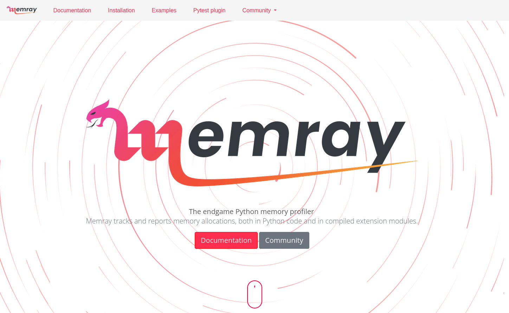

---
# try also 'default' to start simple
theme: default
background: ./images/pyconus-terada-lt.jpg
# apply any windi css classes to the current slide
class: "text-center"
# https://sli.dev/custom/highlighters.html
highlighter: shiki
# show line numbers in code blocks
lineNumbers: false
# some information about the slides, markdown enabled
info: |
  ## Python関連プレゼンテーション
  Manabu TERADA @terapyon

  CMSコミュニケーションズ [CMScom](https://www.cmscom.jp)
  CC-BY 4.0
# persist drawings in exports and build
drawings:
  persist: false
---

# PyHack Con @terapyon

<div class="pt-12">
  <span @click="$slidev.nav.next" class="px-2 py-1 rounded cursor-pointer" hover="bg-white bg-opacity-10">
    プレゼンテーションスタート <carbon:arrow-right class="inline"/>
  </span>
</div>

<div class="abs-br m-6 flex gap-2">
  <a href="https://twitter.com/terapyon" target="_blank" alt="GitHub"
    class="text-xl icon-btn opacity-50 !border-none !hover:text-white">
    <carbon-logo-twitter />
  </a>
  <a href="https://github.com/terapyon/slides" target="_blank" alt="GitHub"
    class="text-xl icon-btn opacity-50 !border-none !hover:text-white">
    <carbon-logo-github />
  </a>
</div>
---

# My history & Python history

- 寺田 学 (Manabu TERADA) [@terapyon](https://twitter.com/terapyon)
- (株)CMS コミュニケーションズ代表
- Python エンジニア兼経営者

Python ベースの Web 系システム構築やコンサルティングを行っている。
昨年から企業や学校に向けたプログラミング教育にも関わっている


---

# バージョン年表 (〜2011 年)

|      | Python 2 | Python 3 | PyHack          | me                         |
| ---- | -------- | -------- | --------------- | -------------------------- |
| 1994 | 1.0      |          |                 | 学生最後の年               |
| ...  |          |          |                 |                            |
| 2005 | 2.4      |          |                 | 起業                       |
| ...  |          |          |                 |                            |
| 2008 | 2.6      | 3.0      |                 | 初の海外カンファレンス参加 |
| 2009 |          | 3.1      | 前身の勉強会    |                            |
| 2010 | 2.7      |          | PyHack スタート | 初の海外で英語 LT          |
| 2011 |          | 3.2      |                 | PyCon JP 主催              |

---

# バージョン年表 (2012 年〜)

|      | Python 2    | Python 3 | PyHack                     | me                       |
| ---- | ----------- | -------- | -------------------------- | ------------------------ |
| 2012 |             | 3.3      |                            |                          |
| 2013 |             |          |                            | PyCon APAC in Japan 主催 |
| ...  |             |          |                            |                          |
| 2016 |             | 3.6      |                            | Python Boot Camp 初講師  |
| ...  |             |          |                            |                          |
| 2020 | End of Life | 3.9      | パンデミックでオンライン化 | podcast 開始             |
| ...  |             |          |                            |                          |
| 2023 |             | 3.12     | PyHackCon                  |                          |

---

# 寺田の仕事

- 会社の代表
- Plone / Volto を使ったWebシステム構築
- Pythonのコンサルティング
- 教育系システムの構築 (オンライン授業/動画/MOOC/LMS)
- Firebaseを使ったシステム構築
- 企業向け研修講師
- オンライン教育 企画・講師・運営

---

# 寺田のその他顔

- 一橋大学社会学研究科 元客員准教授
- 一般社団法人PyCon JP Association 理事
- 一般社団法人Pythonエンジニア育成推進協会 顧問理事
- Python Software Foundation Fellow
- Plone Foundation member (元Ambassador)
- Podcaster -- terapyon channel <https://podcast.terapyon.net/>

---

# 興味・資格

- カメラは完全なるCanon党
- アマチュア無線 電話級
- 国内旅行業務取扱主任者
- 第三種電気主任技術者

---

# Today's Talk




---

# Abount Memray

- Do you know Memray?
- This is very powerful memory profiler.
- Made by Bloomberg


---

# Technique of memory profiler

| 項目                 | 内容                                            |
| -------------------- | ----------------------------------------------- |
| ライブラリ名         | memray                                          |
| プロファイリング手法   | トレーシング                                    |
| 対応 OS              | Linux / macOS                                   |
| Python バージョン    | 3.7 以上（執筆時点で 3.11 まで対応）            |
| 公式サイト           | <https://bloomberg.github.io/memray/index.html> |
| PyPI                 | <https://pypi.org/project/memray>               |
| github               | <https://github.com/bloomberg/memray>           |
| 執筆時点のバージョン | 1.8.0                                           |


---

# How to use Memray

## Install

```sh
$ pip install memray
```

## Run

```sh
$ memray run sample.py
```


## Show result

```sh
$ memray flamegraph memray-sample.py.172322.bin
Wrote memray-flamegraph-sample.py.172322.html
```

---

# Demo

---

# info

- Document: <https://bloomberg.github.io/memray/index.html>
- PyCon US Talk: <https://youtu.be/mqu66lg79X8>
- 日本語の記事: <https://gihyo.jp/article/2023/06/monthly-python-2306>

---

# One more thing...

- Do you use AWS?
- What do you watch `CloudWatch log`?
- AWS web console is not powerful.


---

# CloudWatch log to pandas DataFrame

- awswrangler.cloudwatch.read_logs
- <https://aws-sdk-pandas.readthedocs.io/en/stable/stubs/awswrangler.cloudwatch.read_logs.html>

めっちゃ便利なんで、使ってみて感想などを共有したい

```py
from datetime import datetime
import json
import pandas as pd
import awswrangler as wr
df_raw = wr.cloudwatch.read_logs(
    log_group_names=["log-group"],
    query="fields @timestamp, @message | sort @timestamp desc",
    limit=100,
    start_time=datetime(2023, 6, 17, 0, 0, 0),
    end_time=datetime(2023, 6, 18, 0, 0, 0),
)
df = pd.json_normalize(df_raw.loc[:, "message"].apply(lambda x: json.loads(x)))
```

---

# 旅行業

<div grid="~ cols-2 gap-4">
<div>

## 旅行業には種類がある

- 地域
  - 国内
  - 海外
- 種類
  - 企画旅行
  - 手配旅行

</div>
<div v-click>

## 資格が必要

- 代理店の店舗に1名以上の有資格者が必要
  - 海外旅行を扱う場合は、総合旅行業務取扱管理者
  - 国内のみの場合は、国内旅行業務取扱管理者
- 業態によって登録が必要
- 営業保証金または弁済業務保証金分担金

</div>
</div>


(厳密性がないので参考程度に)

---

# pyhack合宿は大丈夫？

- 不特定多数に募集しているか？ (日常的な接触のある団体内部なのか？)
  - 社員旅行や労働組合の加盟員家族を対象にした旅行は不特定多数にあたらない
- 旅行者から直接料金を収受しているか？
  - 預り金はもらっているが、宿への事前代理支払いのみ
- 企画旅行と言えるのか？
  - 宿のみをまとめて予約しているのでツアーではない
- 手配旅行と言えるのか？
  - 一人の参加者がまとめて宿の予約をし、手数料などを取っていいない

ということで、寺田的には旅行業に当たらないと判断している

---

# Manabu TERADA

- Twitter: @terapyon
- Podcast: terapyon channel <https://podcast.terapyon.net>
