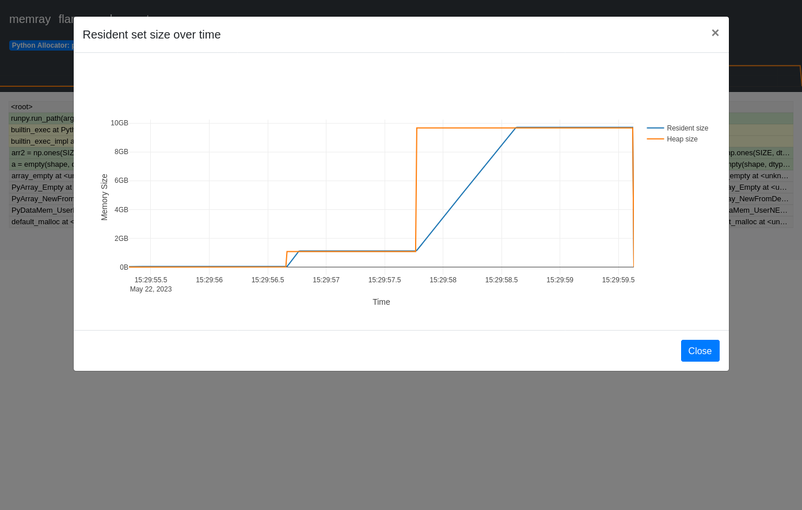

---
# try also 'default' to start simple
theme: default
background: ./images/pyconus-terada-lt.jpg
# apply any windi css classes to the current slide
class: "text-center"
# https://sli.dev/custom/highlighters.html
highlighter: shiki
# show line numbers in code blocks
lineNumbers: false
# some information about the slides, markdown enabled
info: |
  ## Python関連プレゼンテーション
  Manabu TERADA @terapyon

  CMSコミュニケーションズ [CMScom](https://www.cmscom.jp)
  CC-BY 4.0
# persist drawings in exports and build
drawings:
  persist: false
---

# PyHack Con @terapyon

<div class="pt-12">
  <span @click="$slidev.nav.next" class="px-2 py-1 rounded cursor-pointer" hover="bg-white bg-opacity-10">
    プレゼンテーションスタート <carbon:arrow-right class="inline"/>
  </span>
</div>

<div class="abs-br m-6 flex gap-2">
  <a href="https://twitter.com/terapyon" target="_blank" alt="GitHub"
    class="text-xl icon-btn opacity-50 !border-none !hover:text-white">
    <carbon-logo-twitter />
  </a>
  <a href="https://github.com/terapyon/slides" target="_blank" alt="GitHub"
    class="text-xl icon-btn opacity-50 !border-none !hover:text-white">
    <carbon-logo-github />
  </a>
</div>
---

# My history & Python history

- 寺田 学 (Manabu TERADA) [@terapyon](https://twitter.com/terapyon)
- (株)CMS コミュニケーションズ代表
- Python エンジニア兼経営者

Python ベースの Web 系システム構築やコンサルティングを行っている。
昨年から企業や学校に向けたプログラミング教育にも関わっている


---

# バージョン年表 (〜2011 年)

|      | Python 2 | Python 3 | PyHack          | me                         |
| ---- | -------- | -------- | --------------- | -------------------------- |
| 1994 | 1.0      |          |                 | 学生最後の年               |
| ...  |          |          |                 |                            |
| 2005 | 2.4      |          |                 | 起業                       |
| ...  |          |          |                 |                            |
| 2008 | 2.6      | 3.0      |                 | 初の海外カンファレンス参加 |
| 2009 |          | 3.1      | 前身の勉強会    |                            |
| 2010 | 2.7      |          | PyHack スタート | 初の海外で英語 LT          |
| 2011 |          | 3.2      |                 | PyCon JP 主催              |

---

# バージョン年表 (2012 年〜)

|      | Python 2    | Python 3 | PyHack                     | me                       |
| ---- | ----------- | -------- | -------------------------- | ------------------------ |
| 2012 |             | 3.3      |                            |                          |
| 2013 |             |          |                            | PyCon APAC in Japan 主催 |
| ...  |             |          |                            |                          |
| 2016 |             | 3.6      |                            | Python Boot Camp 初講師  |
| ...  |             |          |                            |                          |
| 2020 | End of Life | 3.9      | パンデミックでオンライン化 | podcast 開始             |
| ...  |             |          |                            |                          |
| 2023 |             | 3.12     | PyHackCon                  |                          |

---

# 寺田の仕事

- 会社の代表
- Plone / Volto を使ったWebシステム構築
- Pythonのコンサルティング
- 教育系システムの構築 (オンライン授業/動画/MOOC/LMS)
- Firebaseを使ったシステム構築
- 企業向け研修講師
- オンライン教育 企画・講師・運営

---

# 寺田のその他顔

- 一橋大学社会学研究科 元客員准教授
- 一般社団法人PyCon JP Association 理事
- 一般社団法人Pythonエンジニア育成推進協会 顧問理事
- Python Software Foundation Fellow
- Plone Foundation member (元Ambassador)
- Podcaster -- terapyon channel <https://podcast.terapyon.net/>

---

# 興味・資格

- カメラは完全なるCanon党
- アマチュア無線 電話級
- 国内旅行業務取扱主任者
- 第三種電気主任技術者

---

# Today's Talk


---

# Abount Memray

- Do you know Memray?
- This is very powerful memory profiler.
- Made by Bloomberg



---

# Technique of memory profiler

| 項目                 | 内容                                            |
| -------------------- | ----------------------------------------------- |
| ライブラリ名         | memray                                          |
| プロファイリング手法   | トレーシング                                    |
| 対応 OS              | Linux / macOS                                   |
| Python バージョン    | 3.7 以上（執筆時点で 3.11 まで対応）            |
| 公式サイト           | <https://bloomberg.github.io/memray/index.html> |
| PyPI                 | <https://pypi.org/project/memray>               |
| github               | <https://github.com/bloomberg/memray>           |
| 執筆時点のバージョン | 1.8.0                                           |


---

# How to use Memray

## Install

```sh
$ pip install memray
```

## Run

```sh
$ memray run sample.py
```


## Show result

```sh
$ memray flamegraph memray-sample.py.172322.bin
Wrote memray-flamegraph-sample.py.172322.html
```

---

# Demo

---

# info

- Document: <https://bloomberg.github.io/memray/index.html>
- PyCon US Talk: <https://youtu.be/mqu66lg79X8>
- 日本語の記事: <https://gihyo.jp/article/2023/06/monthly-python-2306>

---

# Manabu TERADA

- Twitter: @terapyon
- Podcast: terapyon channel <https://podcast.terapyon.net>
