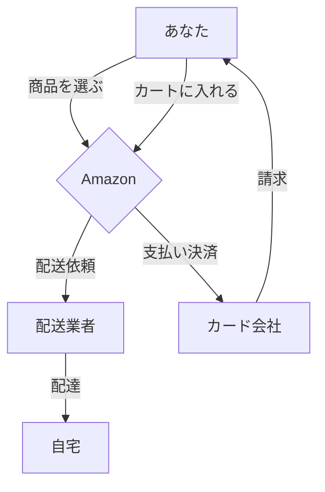
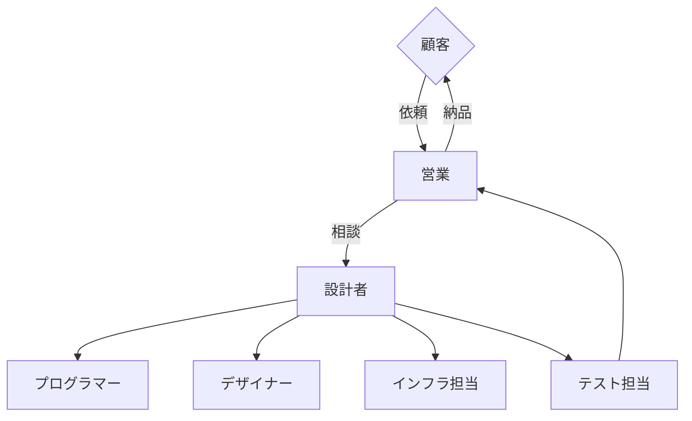

---
# try also 'default' to start simple
theme: default
background: ./images/pyconus-terada-lt.jpg
# apply any windi css classes to the current slide
class: "text-center"
# https://sli.dev/custom/highlighters.html
highlighter: shiki
# show line numbers in code blocks
lineNumbers: false
# some information about the slides, markdown enabled
info: |
  ## Python関連プレゼンテーション
  Manabu TERADA @terapyon

  CMSコミュニケーションズ [CMScom](https://www.cmscom.jp)
# persist drawings in exports and build
drawings:
  persist: false
---

# プログラマーの仕事とは

高校生向けにプログラマーの仕事について説明します。

  
    プレゼンテーションスタート <carbon:arrow-right class="inline"/>
  

  <a href="https://twitter.com/terapyon" target="_blank" alt="GitHub"
    class="text-xl icon-btn opacity-50 !border-none !hover:text-white">
    <carbon-logo-twitter />
  </a>
  <a href="https://github.com/terapyon/slides" target="_blank" alt="GitHub"
    class="text-xl icon-btn opacity-50 !border-none !hover:text-white">
    <carbon-logo-github />
  </a>

---

# 自己紹介

- 氏名: 寺田　学、年齢: 52 歳
- 小さな会社でプログラマー兼社長
- 各種業界団体の代表理事や顧問を務める
- 国立大学法人一橋大学 社会学研究科 元客員准教授

Python ベースの Web 系システム構築やコンサルティングを行っている。

---

# プログラマーってどんなイメージ？

## よく言われること

- 黒い画面に向かって、キーボードを叩いている
- 無口で、寡黙
- 機械と会話している？？

## 実際には

- IT 技術を支える一つである、プログラムを作る
- プログラムしてできるものは、アプリになったり、業務システムソフトウェアになる
- 他には、AI 技術を支えているのもプログラミング

---

# IT ってどんなもの？

- Information Technology の略「情報技術」
- スマホやインターネットが代表的な活用例
- 銀行のシステムや鉄道のチケットや運行管理にも活用されている
- LINE なども IT 技術の結晶でできているもの

---

# ゲームクリエーターとプロっグラマー

- ゲームは、アイデアと技術が必要
- ゲームのシナリオ作り、ルールを作る
- シナリオやルールを実装するのは、多くがプログラマーが必要
- 多くのゲームが、年単位で製品を作る

---

# 普段の生活と IT の関連

- 電車の乗換案内はスマホからサーバにアクセスして結果が表示される仕組み
- LINE でメッセージを送受信できたり、グループチャットができたりする
- 電子決済として Suica や PayPay が使える
- YouTube は動画をサーバにアップロードして、みんなで閲覧できる仕組み
- スマホゲームや任天堂スイッチ

<mdi-train class="text-7xl text-green-400 mx-2"/>
<logos-twitter class="text-7xl text-red-400 mx-2"/>
<mdi-nintendo-switch class="text-7xl mx-2" />
<mdi-credit-card-edit-outline class="text-8xl text-black-400 mx-2"/>
<logos-apple-pay class="text-8xl text-red-400 mx-2"/>
<logos-youtube class="text-8xl text-red-400 mx-2"/>

---

# 業界を区分け

- 物販や製造などの実サービス
- その他のサービス業など
  - 旅行業、宿泊施設、鉄道など
  - 銀行や証券会社などの金融機関
  - 新聞やテレビ局などマスメディア
  - 広告代理店
- IT サービス関係 (インフラ関係、ゲームを含む)
- ゲーム業界
- システム構築専門業者

---

# 業務を区分け

- 全体の計画や仕様を作る
- 詳細設計する
- プログラミングする
- デザインする
- インフラ・基盤を作る
- テストする

---

# 普段どんなことをしているのか？

- システム構築専門業者として
- お客さんの要望を聞き、全体の計画や仕様を作る
- 詳細設計する
- プログラミングしてテストする
- インフラ・基盤を作って、実際に動くようにする
- 要望に合わせて改造したり、修正する

---

# 技術って何？

- 情報技術にもさまざまな物がある
- コンピューターやスマホのようなハードウエア
- Windows や iOS のような OS（基盤ソフト）
- アプリを作る
- ゲームのソフトを作る
- Web サイトを作る

---
layout: section
---

# みなさんからの質問
