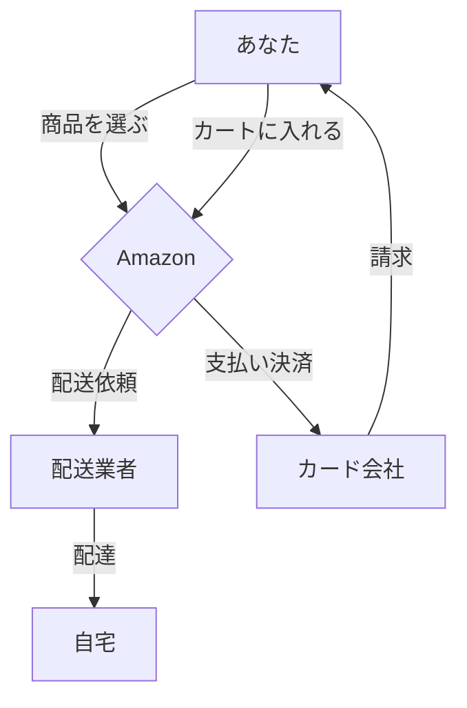

---
# try also 'default' to start simple
theme: default
background: ./images/pyconus-terada-lt.jpg
# apply any windi css classes to the current slide
class: "text-center"
# https://sli.dev/custom/highlighters.html
highlighter: shiki
# show line numbers in code blocks
lineNumbers: false
# some information about the slides, markdown enabled
info: |
  ## Python関連プレゼンテーション
  Manabu TERADA @terapyon

  CMSコミュニケーションズ [CMScom](https://www.cmscom.jp)
# persist drawings in exports and build
drawings:
  persist: false
---

# プログラマーの仕事とは

高校生向けにプログラマーの仕事について説明します。

  
    プレゼンテーションスタート <carbon:arrow-right class="inline"/>
  

  <a href="https://twitter.com/terapyon" target="_blank" alt="GitHub"
    class="text-xl icon-btn opacity-50 !border-none !hover:text-white">
    <carbon-logo-twitter />
  </a>
  <a href="https://github.com/terapyon/slides" target="_blank" alt="GitHub"
    class="text-xl icon-btn opacity-50 !border-none !hover:text-white">
    <carbon-logo-github />
  </a>

---

# 自己紹介

- 氏名: 寺田　学、年齢: 52 歳
- 小さな会社でプログラマー兼社長
- 各種業界団体の代表理事や顧問を務める

Python ベースの Web 系システム構築やコンサルティングを行っている。

---

# プログラマーってどんなイメージ？

## よく言われること

- 黒い画面に向かって、キーボードを叩いている
- 無口で、寡黙
- 機械と会話している？？

## 実際には

- IT技術を支える一つである、プログラムを作る
- プログラムしてできるものは、アプリになったり、業務システムソフトウェアになる
- 他には、AI技術を支えているのもプログラミング

---

# ITってどんなもの？

- Information Technologyの略「情報技術」
- スマホやインターネットが代表的な活用例
- 銀行のシステムや鉄道のチケットや運行管理にも活用されている
- LINEなどもIT技術の結晶でできているもの

---

# 普段の生活とITの関連

- 電車の乗換案内はスマホからサーバにアクセスして結果が表示される仕組み
- LINEでメッセージを送受信できたり、グループチャットができたりする
- 電子決済としてSuicaやPayPayが使える
- YouTubeは動画をサーバにアップロードして、みんなで閲覧できる仕組み
- スマホゲームや任天堂スイッチ

<mdi-train class="text-7xl text-green-400 mx-2"/>
<logos-twitter class="text-7xl text-red-400 mx-2"/>
<mdi-nintendo-switch class="text-7xl mx-2" />
<mdi-credit-card-edit-outline class="text-8xl text-black-400 mx-2"/>
<logos-apple-pay class="text-8xl text-red-400 mx-2"/>
<logos-youtube class="text-8xl text-red-400 mx-2"/>

---

# 業務と業界

# 業界

- 物販や製造などの実サービス
- その他のサービス業など
    - 旅行業、宿泊施設、鉄道など
    - 銀行や証券会社などの金融機関
    - 新聞やテレビ局などマスメディア
    - 広告代理店
- ITサービス関係 (インフラ関係、ゲームを含む)
- システム構築専門業者

## 業務

- 全体の計画や仕様を作る
- 詳細設計する
- プログラミングする
- デザインする
- インフラ・基盤を作る
- テストする
- 詳細な役割
    - プログラマー
    - デザイナー
    - インフラ担当
    - テスト担当

  

---

# 普段どんなことをしているのか？

- システム構築専門業者として
- お客さんの要望を聞き、全体の計画や仕様を作る
- 詳細設計する
- プログラミングしてテストする
- インフラ・基盤を作って、実際に動くようにする
- 要望に合わせて改造したり、修正する

---

# 技術って何？

- 情報技術にもさまざまな物がある
- コンピューターやスマホのようなハードウエア
- WindowsやiOSのようなOS（基盤ソフト）
- プログラミング言語
- プログラミングを支えるツール
- インターネットを支える技術（ブラウザやネットワークなど）

---
layout: section

---

# 今すべき勉強は？

<!--
- 好きなことからやれば良いと思う
- すぐに何かを作りたいなら
    - プログラミング言語やツールなどを学んで何かを作ってみる
- じっくりやるなら
    - 変化の少ない基盤やベース技術を学ぶ
- IT技術にすぐに興味が持てないなら
    - 数学や物理といった基礎学力
- それもイマイチっていう人は
    - 国語や英語、社会でも良いので何かしらの学力を付けておく
    - 実際には仕様を書いたり、ドキュメント（技術文書など）を読むことが多いので言語や裏にある社会的な考え方は役に立つ
-->

---
layout: section

---

# 大学・専門学校・就職・その他の選択はどうする？

<!--
- 具体的に勉強したいものがある人
    - 大学の工学部などの情報工学科を目指す
    - 専門学校で技術を学ぶ
- そこまで具体的に決まっていないなら
    - 大学で幅広い知識を学び、その上で次の道を考えるのが良いと思う
- もし、プログラミング力などに自身があり、勉強よりも実践って思っている人は
    - 就職をして、力を付けていく
-->

---
layout: section

---

# プログラミングを今から学んだほうが良いか？

<!--
- いずれやることになるし、高校でも少しややることになる
- 嫌いになると辛いので、好きになれるように勉強できると良いとは思う
- ただ、すぐになんでもできるようになるわけではないので、頑張って着実に継続する必要がある
-->

---

# 学校からの質問

- 職業を選んだきっかけ
- 仕事の内容
- 高校卒業から今の職業まで
- 高校時代に取り組んでいたこと、考えたいたこと
- 高校時代にやっておくべきだったこと

<!--

- 職業を選んだきっかけ
    - 元々、電機制御メーカーの営業だった。
    - 大規模な設備投資などに影響される分野でつまらなくなった。さらに自分で物を作りたくなったので、プログラミングを勉強してプロのプログラマーになった
- 仕事の内容
    - 上記で回答済み
- 高校卒業から今の職業まで
    - 高校3年生は理系でした。
    - 専門学校に行こうかと思っていたが、高校の先生と親に強く押されて、工学部電気工学科に行った
    - 大学時代に強く挫折をし電気などの技術を離れたかったが、大学の教授に言われて、言葉は知っているので、メーカー営業の道へ行ったらどうだと言われた
    - 就職難が始まったときだったので大変だったが、30人程度のベンチャー系電機制御メーカの営業になる
    - IT系が楽しそうに見えた（2003年ごろ）
    - プログラミングを勉強して、専門性の高いシステム構築専門業を起業した
    - コミュニティなどを積極的に牽引して、さまざまな役割をもらった
    - 今は、業界団体の代表理事や顧問理事をやったり、大学で客員准教授をやることになった
- 高校時代に取り組んでいたこと、考えたいたこと
    - 写真部や生徒会で活動していた
    - 数学と物理は勉強していた
    - 英語は苦手で大変だったし、国語は全く興味を持たなかった
    - カメラ屋でアルバイト
- 高校時代にやっておくべきだったこと
    - 本を読む
    - 勉強できる力を付ける。（大学に行って挫折しなかったと思う）
-->

